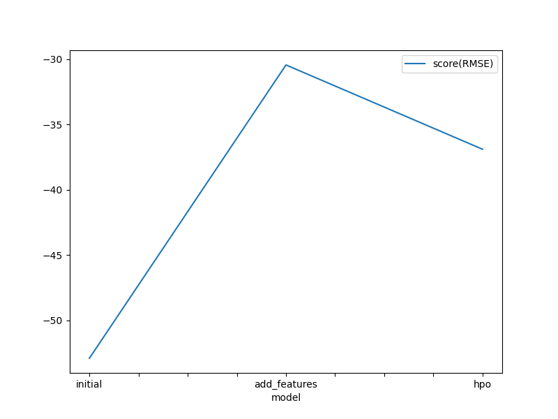
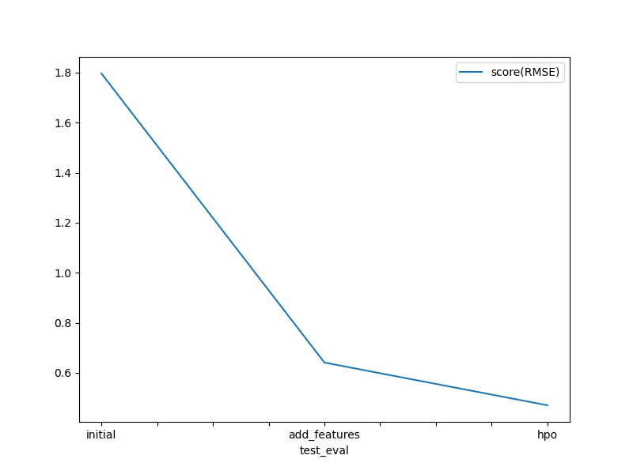

# Report: Predict Bike Sharing Demand with AutoGluon Solution
### by Femi Bolarinwa

## Initial Training

The top model performance after initial training was 53 counts (RMSE) from actual counts. This could be attributed to the fact that default predictor variables in the train data were used. I needed to ensure there were no negative counts in the predictions (because its unrealistic), and the prediction were fitted to the dataframe format required by kaggle.

After initial model training with autogluon, WeightedEnsemble_L3 had the best performance with RMSE of 53 counts on training data. However it took the most fit and predict time amongst the top performing model. The model yielded a RMSE of ~2 counts on unseen test data

## Exploratory data analysis and feature creation

A quick exploration of the features show that the 'season' and 'weather' features were integer data types. A change of data type was needed. A categorical data type would be more accurate so the data types were changed. Also addition features were extracted from the datetime. This included year, month, day, hour and quarter.

Top performing model was still WeightedEnsemble_L3. RMSE on training data improved from 53 to 30, and on test set from ~2 to 0.64. The engineered features and the new category variables (season, weather) appear to have significant predictive power.

## Hyper parameter tuning

Some parameters of the top performing models from previous autogluon run were optimized as shown in the hyperparameter table below. The top performing model was RandomForest_BAG_L1 (with 300 estimators) with a score of 38 counts (RMSE) on training data. The model performance on test data improved slightly from 0.64 to 0.47

## Further work in the feature

The distribution of the target variable (count) is skewed. I would explore some transformation (log, square root, inverse, etc) to bring distribution close to normal/gaussian.

To achieve more predictive features, I would also bucketize:
    1) the datetime column into morning, lunch and evening rush hour categories
    2) temperature feature into hot/cold/mild categories
    3) humidity feature into high/low humidity.

## Trend of top model performance on train data

## Trend of top model performance on unseen test data

## Hyperparameters table

## Summary

Exploring the data help to identify datatypes that are better appropriate for modelling. The performance of top model was improved by engineering features that have predictive power. Autogluon/AutoML allowed to automatically train and compare multiple models within a designated timeframe. Autogluon also provides infomation like fit and predict time. This is very useful in case where inference latency in production is crucial.
